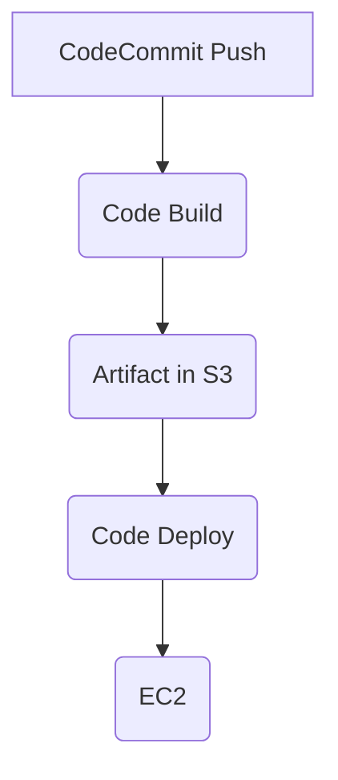

# AWS CI/CD Pipeline | Devops | Project

---

CI/CD Project To Deploy Web Application using with AWS CI/CD pipeline. Developer Tools used CodeCommit, CodeBuild, CodeDeploy, CodePipeline , EC2, S3, IAM .

## CICD Pipeline Workflow Diagram

-----

Steps To Perform

- Create AWS Instances on EC2
- Configuring IAM roles
- Create a shell script to install & start codeploy-agent in ec2 server
- Push the code into CodeCommit
- Setup Code Build
- Setup Code Deploy
- Setup Code Pipeline 

